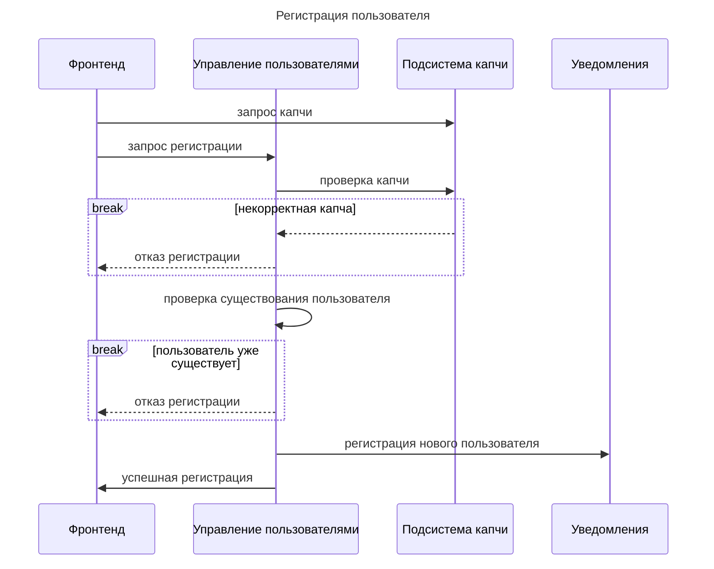
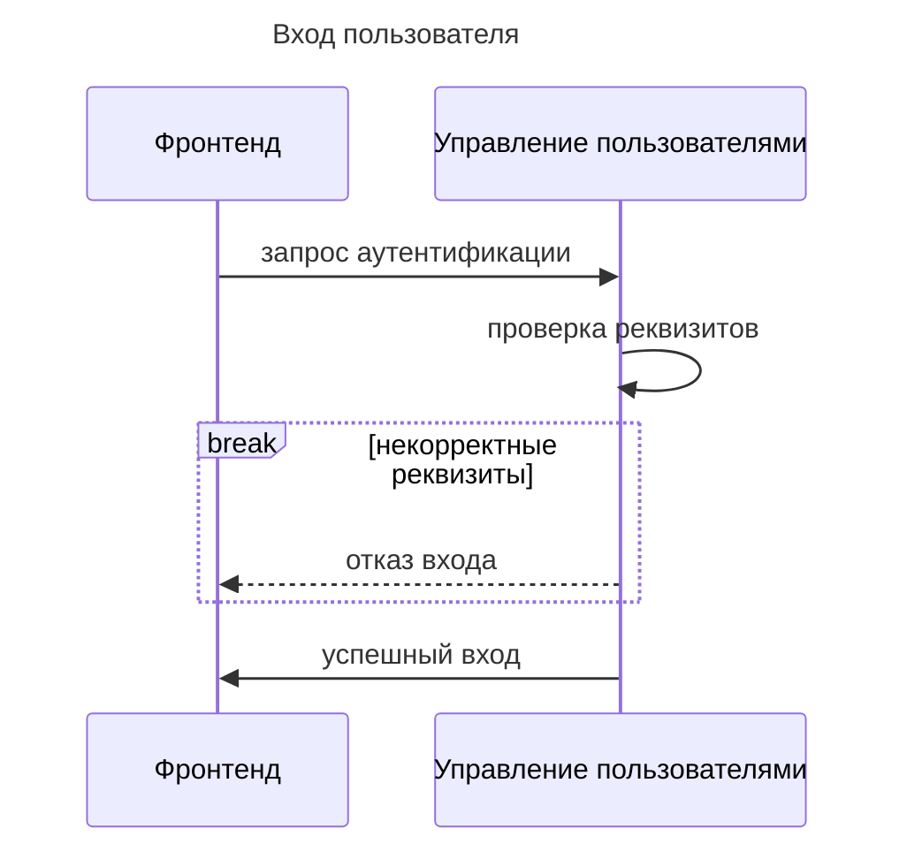
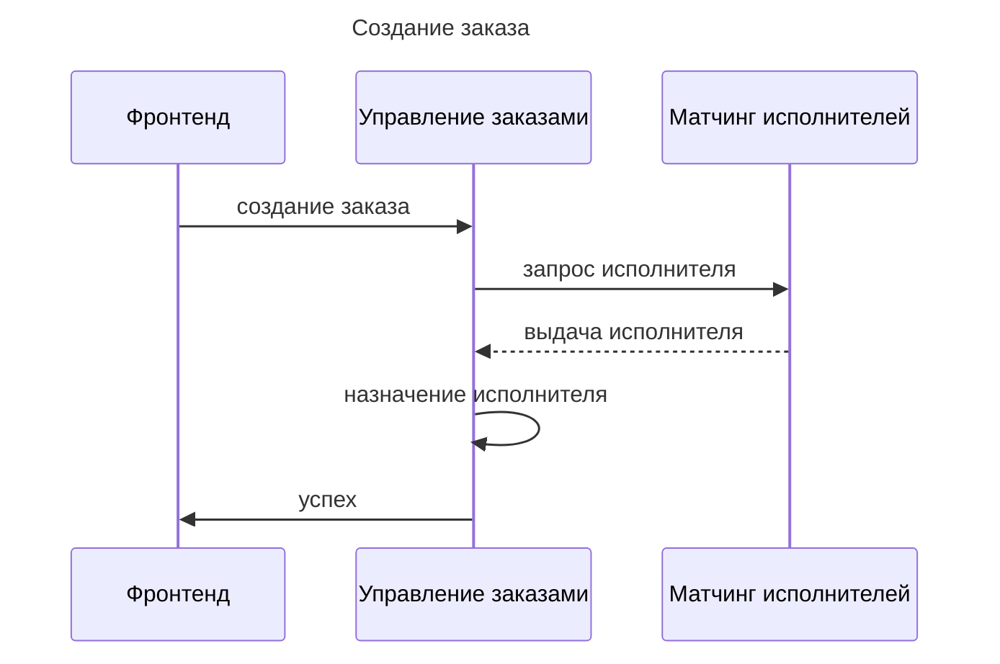
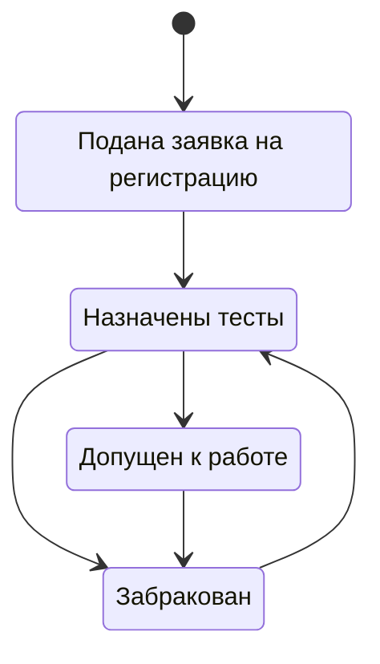
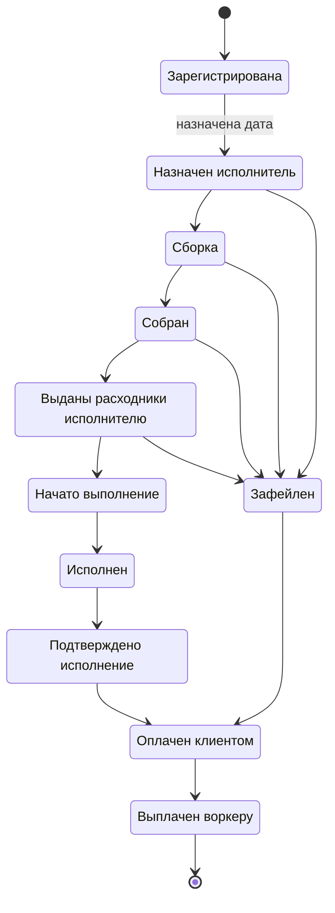
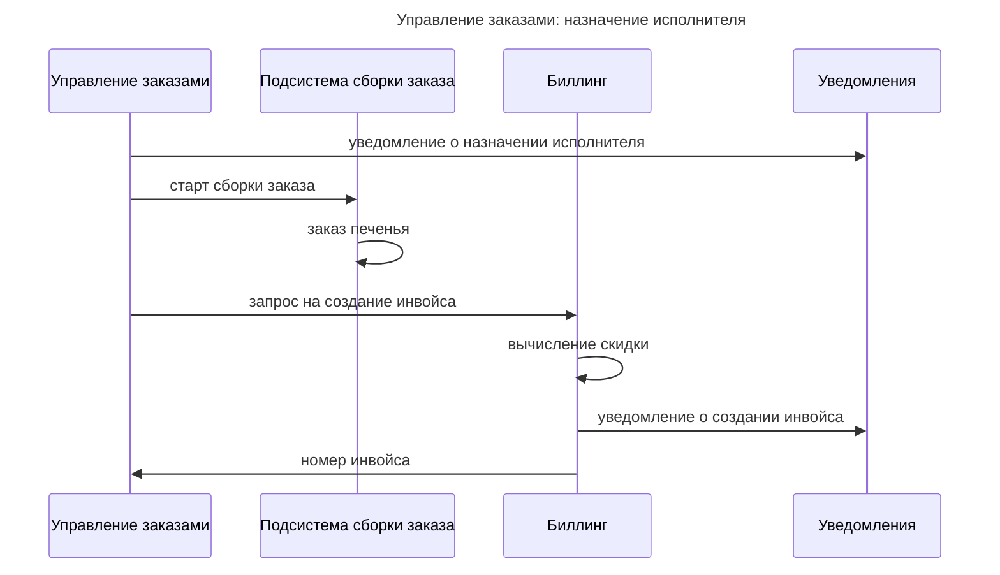
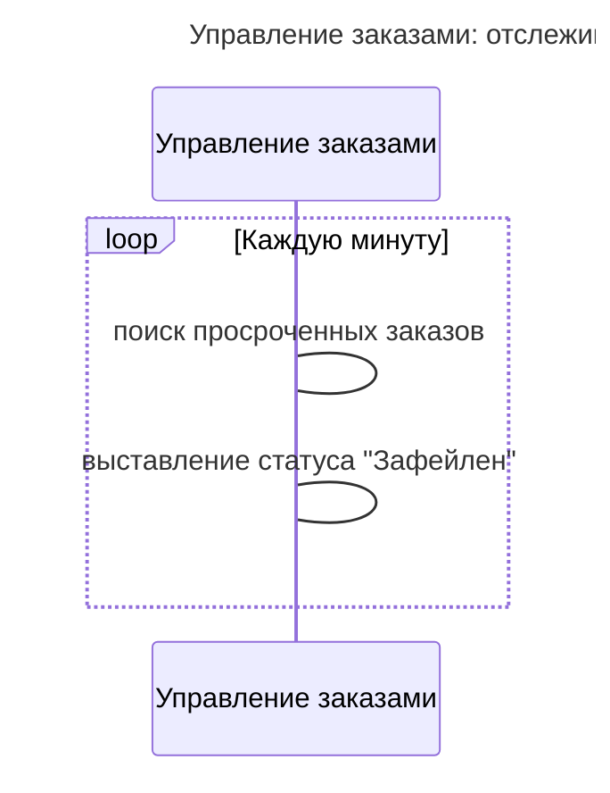

# Роли в системе

Ниже перечислены роли пользователей системы, их действия в рамках системы и отсылки к пользовательским историям для этих действий:

  * Клиенты (коты-тестировщики)
  	* делают заказы [US-010, US-020, US-271]
  	* подтверждают исполнение (выполнено/не выполнено) [US-030, US-170, US-272]
  	* выбор способа списания денег [US-190]
  	* просмотр инвойсов по списаниям [US-220]
  	* оплата инвойсов [US-274]
  	* прогноз списаний [US-230]
  * Менеджеры
  	* управляют типами услуг [US-021]
  	* обрабатывают заявки на регистрацию [US-080, US-090, US-271]
  	* проверяют качество услуги [US-160, US-180, US-275]
  	* просмотр фейлов для выработки гипотез [US-180]
  	* выплата чаевых воркерам [US-240]
  	* делают ставки на выполнение [US-250, US-260]
  * Исполнители (воркеры)
  	* регистрируются [US-080, US-271]
  	* проходят тесты [US-100, US-271]
  	* просматривают список задач [US-120]
  	* исполняют заказы [US-070]
  	* просмотр инвойсов начислений [US-220]
  	* прогноз начислений [US-230]
  * Сборщики расходников
  	* сбор [US-140, US-150, US-273]
  	* выдача расходников [US-130]
  	* подтверждение выдачи [US-140]
  * Подрядчик печений с предсказаниями
  	* изготовление и доставка печенья [US-150]

# Подсистемы

Для реализации пожелания по уменьшению TTM будем реализовывать монолит, чтобы не тратить время на разработку и отладку коммуникаций между подсистемами.

Взаимодействие между фронтом и беком делаем по API для реализации:
  1. Упрощения тестирования по контрактам
  2. Параллелизации разработки
  3. В дальнейшем упрощения разработки альтернативных фронтов (мобилка)
  4. Масштабирования
  5. Реализации "отзывчивого" фронта даже при перегруженном бекенде

Другие решения
  1. Для ускорения регистрация будет доступна только исполнителям. Клиенты, менеджеры и сборщики -- это сотрудники компании, они будут импортироваться автоматически из существующей БД.

## Фронтенд

Необходимо реализовать:
  * экран регистрации исполнителей
  * экран входа для пользователей
  * получение информации о ролях пользователя (для формирования допустимых экранов)
  * экран списка заказов (с фильтрами)
  * экран конкретного заказа
  * экран списка инвойсов
  * экран конкретного инвойса
  * экран создание заказа (для пользователей)
  * экран списка тестов
  * экран конкретного теста
  * экран назначения тестов конкретному воркеру
  * экран управления ставками

## Бекенд

Модули монолита:
  * Управление пользователями
  	* Подсистема капчи
  * Управление заказами
  	* Подсистема сборки заказа
  	* Подсистема матчинга исполнителей
  * Ставки (биллинг для менеджеров)
  * Биллинг
  * Уведомления

Модуль "Подсистема сборки заказа" выделен для того, чтобы иметь возможность в дальнейшем усложнять систему сборки заказа, менять поставщиков и их количество без необходимости менять остальную систему.

Модуль "Подсистема матчинга исполнителей" -- аналогично.

Модуль "Ставки" выделен т.к. не является системой отчетности, не требует выставления инвойсов и четких расчетов, а в дальнейшем может быть переделан или упразднен.

Модуль "Уведомления" нужно сделать отдельным сервисом с коммуникацией через какой-нибудь брокер сообщений (например, RabbitMQ). Это позволит:
  1. масштабировать отправку писем
  2. вынести логику доотправки писем если почтовый сервер недоступен/перегружен и т.п.
  3. в дальнейшем добавить другие каналы оповещений (пуши и т.п.)

## Управление пользователями

Алгоритмы, которые необходимо реализовать:

  1. Вычисление характеристик по результатом тестов [US-100]
  2. Капча (использовать готовую реализацию) [US-081]

### Регистрация пользователя

### Вход пользователя

## Управление заказами

Алгоритмы которые нужно реализовать:

  1. Автоматический фейл задач [US-110, US-170, US-260, US-272]
  1. Матчинг исполнителя под задачу [US-060, US-276]

### Создание заказа

## Биллинг

  1. Расчет стоимости задачи [US-020, US-050], вычисление скидки [US-040]
  2. Списание денег с клиентов [US-030, US-190]
  3. Начисление денег исполнителям [US-200, US-210, US-240]

## Ставки

  1. Начисление менеджерам [US-250, US-260]

## Уведомления

Входящие события:

  * Управление пользователями:
  	* Регистрация воркера [US-271]
  	* Прохождение теста [US-271]
  	* Получение результатов обработки теста [US-271]
  * Управление заказами:
    * Изменение статуса услуги [US-272, US-273, US-276]
    * Результат контроля качества [US-275]
  * Биллинг
  	 * Выставление инвойса [US-274]
  	 * Оплата инвойса [US-274]

# Диаграммы статусов

##  Статусы воркеров (исполнителей)

## Статусы задачи

### Управление заказами: назначение исполнителя

### Управление заказами: отслеживание исполнения заказа

# Непонятные моменты

  1. Что такое вакансия кота и как она фигурирует в системе (кроме тестов) [US-090]
  2. Какие менеджеры могут ставить ставки?
  3. Что делать, если заказчик не указал дату выполнения?
